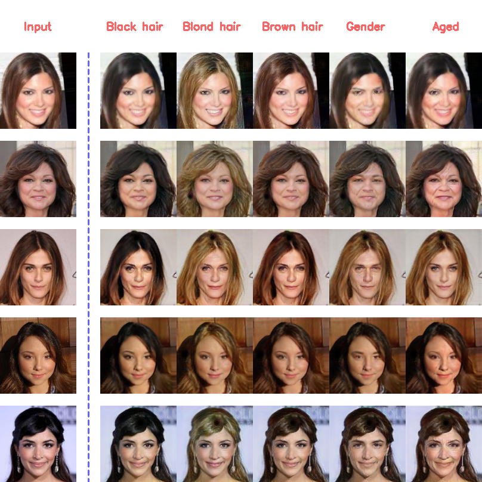
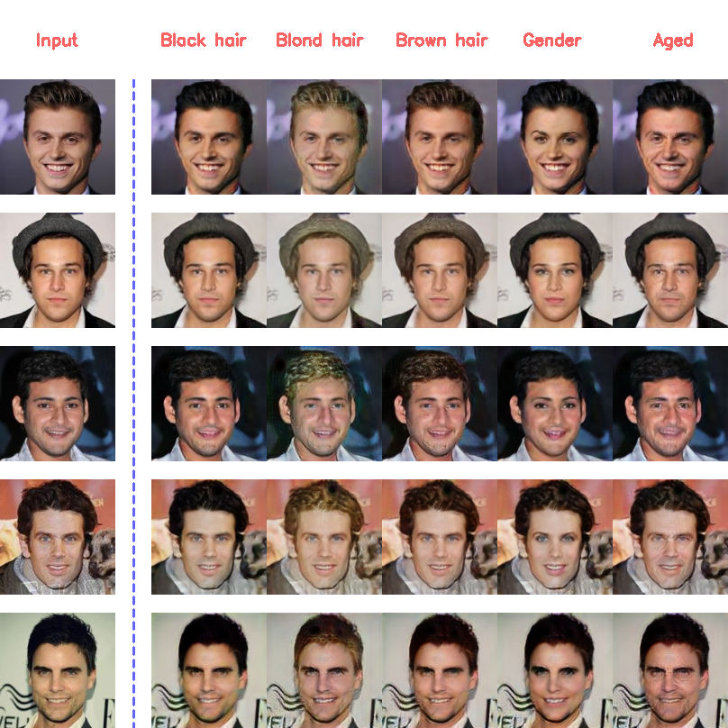

<p align="center"></p>

--------------------------------------------------------------------------------

## Usage
### Downloading the dataset
```bash
$ bash download.sh celeba
```

### Train
* python main.py --mode train

### Test on celebA images
* python main.py --mode test 

### Test on custom images (please put your images into './samples' directory)
* python main.py --mode custom --custom_image_name <test.png... name of your image> --custom_image_label <1 0 0 1 1 - 5 target labels of your choice>

### Pretrained model
* Download [G_weights.hdf5](https://drive.google.com/file/d/16n6yeQbQh4hOgobXspTU5dwEbLtnlk45/view?usp=sharing) and put into './models' directory.

## Summary


## Results (128x128)
### Women


### Men


## Related works
* [Keras-GAN](https://github.com/eriklindernoren/Keras-GAN)
* [StarGAN-Tensorflow](https://github.com/taki0112/StarGAN-Tensorflow)

## Reference
* [StarGAN paper](https://arxiv.org/abs/1711.09020)
* [Author pytorch code](https://github.com/yunjey/StarGAN)

## Author
HOANG Duc Thang
